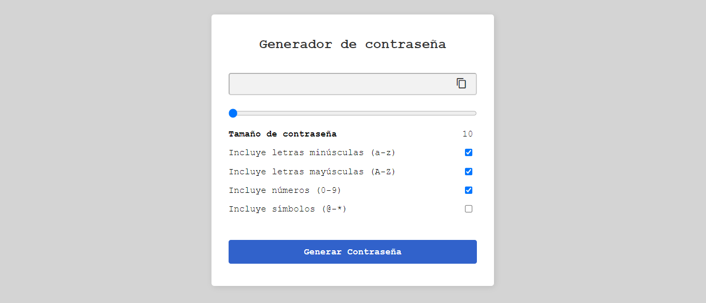
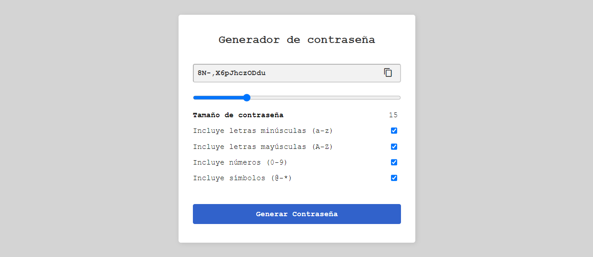

# Generador de Contraseña

Una aplicación web simple y eficiente para generar contraseñas aleatorias con diferentes criterios de seguridad. Puedes elegir incluir letras minúsculas, mayúsculas, números y símbolos, además de definir la longitud de la contraseña.



## Características

- **Generación de Contraseñas:** Genera contraseñas aleatorias basadas en los criterios seleccionados.
- **Copiar Contraseña:** Copia la contraseña generada al portapapeles con un solo clic.
- **Personalización:** Configura la longitud de la contraseña y selecciona qué tipos de caracteres incluir.

## Instalación y Uso

1. **Clonar el repositorio:**
   ```bash
   git clone https://github.com/Nathaly-Daza/GenerarContra.git
   ```

2. **Navegar al directorio del proyecto:**
   ```bash
   cd Generarcontra
   ```

3. **Abrir el archivo `index.html` en tu navegador:**
   ```bash
   open index.html
   ```
   O simplemente arrastra el archivo `index.html` a una ventana de tu navegador.

## Archivos del Proyecto

- `index.html`: El archivo HTML principal que estructura la aplicación.
- `styles.css`: Archivo CSS que contiene los estilos de la aplicación.
- `script.js`: Archivo JavaScript que maneja la lógica de la aplicación.
- `img/screenshot_main.png`: Captura de pantalla de la aplicación (debes añadir esta imagen).

## Capturas de Pantalla

### Vista Principal


### Generación de Contraseña




## Personalización

Puedes personalizar la aplicación modificando los archivos `styles.css` y `script.js` según tus necesidades. Por ejemplo, puedes cambiar los colores, fuentes o diseños utilizados.

## Contribuciones

Las contribuciones son bienvenidas. Por favor, abre un issue para discutir cualquier cambio que te gustaría realizar.
